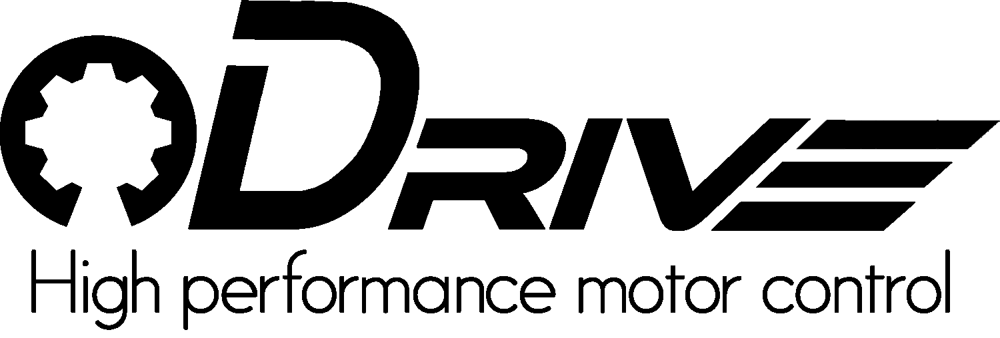

<h1 align="center">  </h1>

<h2 align="left">Hello, folks! 👋</h2>

My name is Florian Zachs, I’m 19 years old and I'm a hobbyist in robotics and software development. I live in Austria and I just graduated. Let's see what the following years will bring :)

<h2 align="left">About me</h2>

- 💡 I’m interested in: **C++, Robots, Arduino, Embedded systems**

- 👯 I’m looking to collaborate on: [The official ODrive project](https://odriverobotics.com)

- 📫 How to reach me: **herrnamenlos123@gmail.com**

<h3 align="left">Connect with me:</h3>

<h3 align="left">My Skillset:</h3>

## Supporting 💪

I do all of my projects in my free time and I do not get any money for that. I just like what I do, do it for myself and want to share it so that others can benefit too.

Exactly for this reason would it be even more amazing if you could find the motivation to buy me a coffee :)

<h3 align="left">Projects I am most proud of:</h3>

<table border=0>
<td>

</td>
<td>

</td>
</table>