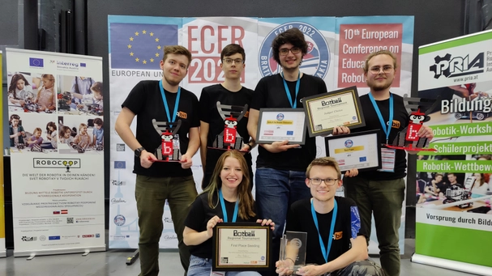
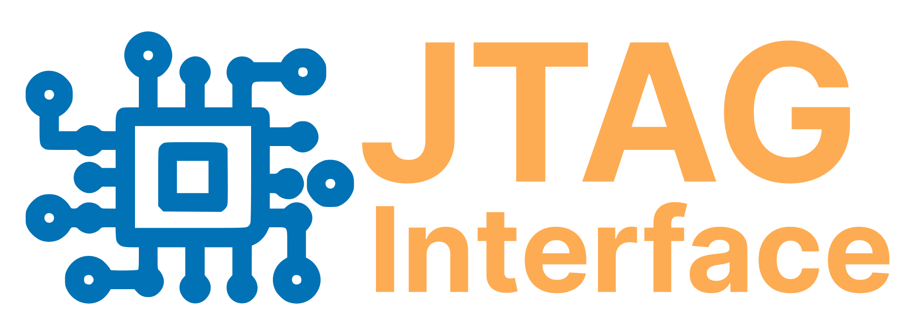

<h1 align="center">  </h1>

<h2 align="left">Hello, folks! 👋</h2>

My name is Florian Zachs, I’m 20 years old and I'm a hobbyist in robotics and software development. I live in Austria and I just graduated. Let's see what the following years will bring :)

<h2 align="left">About me</h2>

- 💡 I’m interested in: **C++, Robots, Arduino, Mobile Robotics**

- 📫 How to reach me: **herrnamenlos123@gmail.com**

<h3 align="left">My Skillset:</h3>

<h3 align="left">Connect with me:</h3>

## My Robotics team

Back in school we founded a robotics team of 6 students in our association [robo4you](https://robo4you.at) and we called ourselves [qbit](https://robo4you.at/teams/). The goal was to compete in several mobile robotics competitions worldwide and we were very successful:

 - First Place Seeding & Second Place Overall at GCER 2022 in Oklahoma/USA
 - First Place Overall at ECER 2022 in Bratislava/Slovakia
 - Second Place Overall at ECER 2019 in Vienna/Austria

We all graduated and can no longer take part, but we would love to come back in the future and cooperate on projects in the area of Mobile Robotics, Autonomous Drones and AI-based Robotics in general. We are looking forward to possible cooperations with innovative companies shaping the future.

## Radboud University Nijmegen🎓

My most successful project so far was the JTAG Interface (see below). It is an honor for me to say that even the [Radboud University Nijmegen](https://www.ru.nl/en) in the Netherlands found it interesting.  

The Radboud University's Department of AI offers a course in [Neuromorphic Engineering](https://en.wikipedia.org/wiki/Neuromorphic_engineering) and as it turns out, students of the neuromorphic enginnering course now use my Arduino library to test FPGA implementations for the simulation of nervous systems.  

It really is an honor for me, thank you for the collaboration!

<h2 align="left">Featured Projects:</h2>

<table border=0>
<tr>
    <td width="50%">
        
    </td>
    <td width="50%" >
        
    </td>
</tr>
<tr>
    <td width="50%">
        
    </td>
    <td width="50%" >
        
    </td>
</tr>
</table>

## Support 💪

I do all of my projects in my free time and I do not get any money for that. I just like what I do, do it for myself and want to share it so that others can benefit too.

I like to drink beer and any support is greatly apprechiated :)

